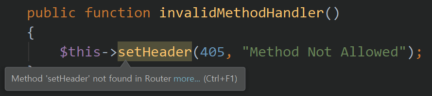
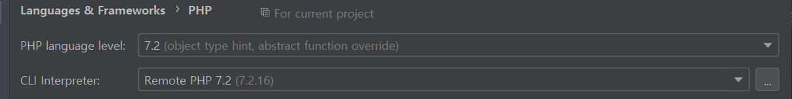

<!-- markdownlint-disable MD033 -->
# 코드 리뷰 (1차)

## phpStorm의 Warning

- 코드 글자색이 아닌 배경색으로 노랗게 처리되는 부분
  - Warning 알림이므로 없애주어야 함
  - 마우스 커서 hover시 자세한 내용 확인 가능

    

- phpStorm에 설정된 php 버전이 달라서 생길 수도 있음
  - php language level 자신에게 맞게 변경
  - `File > Settings... > Languages & Frameworks > PHP > PHP language level`

    

## phpDocs

- 가능한 클래스, 멤버 함수 등 parameter, return type 등을 표시하는 습관

```php
...
    /**
     * Find regex pattern about route string
     * @param string route
     * @return string regexPattern
    */
    private function getRouteRegexPattern(string $route): string
    {
        $paramPattern = '[a-zA-Z0-9-_]+';
        $routePattern = preg_replace('/\//', '\\/', $route);
        $routePattern = preg_replace('/:[a-zA-Z0-9-_]+/', $paramPattern, $routePattern);
        $routePattern = '/^' . $routePattern . '$/';
        return $routePattern;
    }
...
```

## autoload 기능 100% 활용하기

- 코드 내에 `autoload.php`를 불러오는 것을 제외한 `require`를 일체 없게 구현하기
- 이는 다른 유저가 패키지를 쉽게 사용할 수 있게 하기 위함이기도 함
- 전역 변수 지양
- 꼭 사용하고 싶으면 싱글톤 전역 변수용 클래스를 만들어서 사용하라

## magic function 지양

- `__call()`같은 php 매직 함수의 사용 지양하기
- 함수의 call stack을 tracking하기도 어려움
- 필요하다면 별도의 wrapper function을 만들어 대체하라

## PDO를 통한 DB connection

- PDO는 디비 연결을 통일된 방식으로 제공하는 추상화 클래스일 뿐
- 웹 서버로의 요청, 응답의 한 사이클 동안 DB 커넥션 한 번 내에 여러 쿼리들이 작동한다고 생각
- 트랜잭션이 없는 구조로 동작하게 하는 것이 Best이지만 필요하다면 트랜잭션 이용해도 무방

## closure (anoymous function)

- 함수형 프로그래밍을 위한 클로저 사용시 클로저 자체를 주고 받기 위해 클로저 생성 함수 사용

```php
class Auth
{
    ...
    public static function validCheckFunction(Config $conf)
    {
        return function (Context $ctx) use ($conf): bool {
            ...

            if (empty($ctx->req->httpXAccessToken)) {
                return false;
            }
            ...
            return true;
        };
    }
    ...
}
```

***

## 개인 서버 구조 관련

- Router에 middleware를 등록하기 위해 통일된 구조로 클로저를 등록
- 가변인자 처리를 통해 여러개의 middleware를 등록할 수 있도록 설정
- `next()`를 통해 다음 미들웨어로 넘어갈 수 있도록 설정
- `error handling` 고려