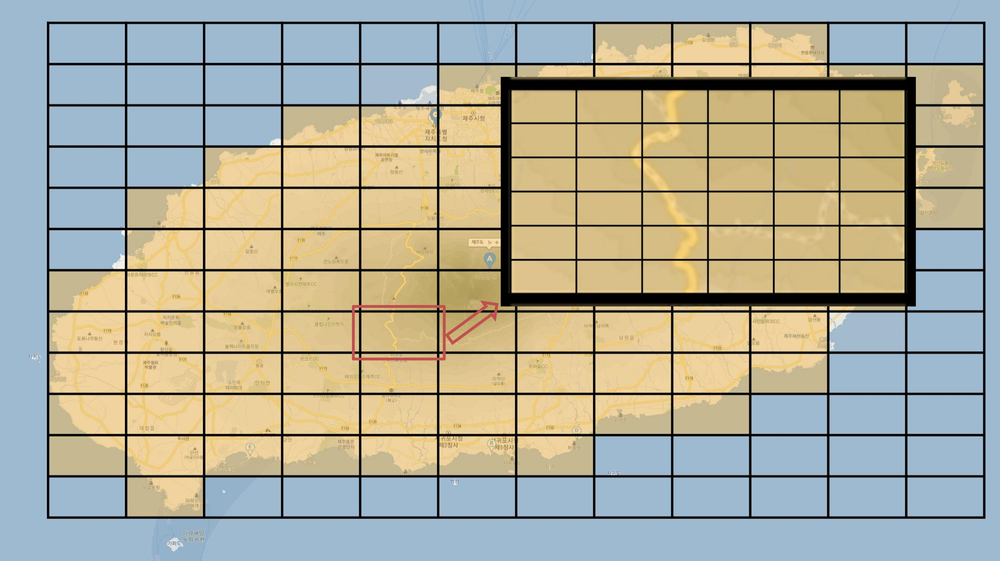

<!-- markdownlint-disable MD033 -->
# 기획서

## 게임 내용 소개

***

## 이제부터 당신은 새로운 영토에서 영민들을 다스리는 영주 김압둘 입니다

- 중세시대 제주도는 비옥한 토양과 다양하고 풍부한 자원이 있는 파라다이스입니다.
- 무작위로 시작되는 지역에서 터를 잡고 자원을 생산하십시오.
- 자원을 기반으로 발전하여 태평성대를 이루십시오.

## 가장 중요한 것은 자원입니다

- 자원은 크게 전략자원, 식량자원, 사치자원이 있습니다.
- 전략자원은 성과 건물을 튼튼하게, 무기의 공격력을 강하게 만들어줍니다.
- 식량자원은 영민들이 많이 번영하게 되어 인력을 풍부하게 해줍니다.
- 모든 일은 일력이 필요합니다.
- 사치자원은 영민들의 충성도를 높여줍니다.
- 충성도는 어떤 일이든 추가적인 보너스를 제공합니다.

## 없다면 뺏고 있다면 지키십시오

- 지역별로 존재하는 자원의 종류와 양이 각기 다릅니다.
- 성을 더욱 튼튼하게 지어서 자원을 지키십시오.
- 무기를 단련하고 군대를 양성하여 원하는 자원을 뺏으십시오.

## 영원한 적도 친구도 없다

- 특정 지역에는 그 지역을 다스리는 보스가 살고 있습니다.
- 다른 지역의 영주와 동맹을 맺고 보스를 물리치고 점령하십시오.
- 특별한 자원과 버프를 전리품으로 가질 수 있습니다.

## 꾸준히 다스리십시오

- 매일 특별한 자원과 아이템 혹은 버프를 획득하십시오.
- 주마다 충성도, 레이드 누적 데미지, 누적 자원량이 월드에 순위가 매겨집니다.

***

## 데이터 설계

***

## 맵

1. 영토
   - <제주도를 12x12개의 cell로 분할>
   - x,y 좌표 <cell의 중심?>
   - 지역의 거리 (L2 distance)

2. 특수 지역
   - 영토로 사용할 수 없음
   - 보스가 등장, 처치시 점령가능
   - 점령 기간 동안 자원, 버프
   - 점령 기간 중 점령전으로 뺏기 가능

3. 영내
   - 각 영토는 6X6 타일로 분할됨
   - 특정 타일에는 자원이 존재할 수 있음
   - 해당 자원에 부합하는 건물을 세워야 자원 채취 가능

## 자원

- 자원들을 획득 하기 위해선 `자원 채취 건물`이 필요
- 자원 별 `자원 채취 건물` 조건을 만족하면 단위 시간 당 지속적으로 자원 획득
- 맵에 존재하는 자원은 위치, 단위 시간 생산량 고정
- 각 자원 모두 무한 자원 (단위 시간당 일정량의 자원 생성)
- 각 자원 별로 효율이 다름 (단위 시간당 생성하는 자원량이 다름)

1. 전략 자원
   - 철, 구리, 석탄, 석재, 나무
   - 건물 및 성을 업그레이드 하여 방어력 향상시키는데 사용
   - 무기 제작 및 업그레이드 하여 공격력 향상시키는데 사용

2. 식량 자원
   - 쌀, 보리, 밀, 감자, 옥수수 <각각 효율(PPU, Production Per UnitTime)이 다른건지?>
   - 인구 수 비례로 필요한 최소 식량 자원 존재 (식량 자원이 불충분 할 시 인구가 줄어듦) <줄어드는 인구가 현재 인구? 최대 인구?>
   - 최소 식량자원을 넘기면 인구 증가
   - 인구는 식량자원을 소모하며 단위 시간당 식량 자원 생산량

3. 사치 자원
   - 금, 은, 진주, 향신료, 차(tea)
   - 영민들의 충성도를 높이는데 사용됨
   - 인구 수에 비례하여 요구되는 사치 자원량이 결정됨
   - 충성도가 높으면 '인력이 필요한 모든 기능'에 버프를 받음
   - 충성도가 낮으면 '인력이 필요한 모든 기능'에 디버프를 받음
   - 충성도는 버프 형식으로, 일정량의 사치 자원을 소모함으로써 특정 시간동안 버프 효과 발생
   - 단 사치 자원은 맵에 등장하는 빈도가 낮음, 생산시간도 엄청 김

## 건물

- 성, 방어탑, 병영은 업그레이드가 가능함

1. 성
   - 인구를 생산
   - <추가> 식량 자원과도 상관이 있으므로 기본 자동 생산으로 하되 토글 형식으로 조절할 수 있게 설정
   - 기본 통치에 필요한 기능을 제공, 방어력 제공
   - 업그레이드 : 인구 생산률 증가, 방어력 증가

2. 자원 채취 건물
   - 전략 자원 : 광산 건물 필요
   - 식량 자원 : 농장 건물 필요
   - 사치 자원 : 타입에 따라 광산 혹은 농장 건물 필요

3. 병력 건물
   - 방어탑 : 총 방어력 향상 (다른 영주(유저)의 공격으로 부터 효율적으로 방어하는 건물)
     - 업그레이드 : 방어력 추가수치 상승
   - 병영 : 일부 인력을 소집하여 다른 영토를 공격할 수 있음
     - 업그레이드 : 소집 인력 수 상승
   - 공방 : 건물 및 성의 방어력을 업그레이드, 무기 생산 및 업그레이드 하여 공격력 향상시키는데 사용됨  
     (업그레이드는 테란의 아카데미 처럼..)

4. 특수 건물
   - 곡창 : 식량 자원의 수 향상
   - 공장 : 전략 자원의 수 향상
   - 박물관 : 영민의 충성도 향상
     - <추가> 박물관을 통해 상승하는 충성도는 박물관 인구 배치가 유지되는 한 지속
     - <추가> 사치자원 충성도 버프가 있는 경우 박물관 충성도와 단순 합산
   - <자원과 충성도를 어떻게 향상시키는지? 고정값? 현재값 비례?>

## 특수 지역 보스

1. 설문대할망
   - 바다한가운데 섬을 만들기 위해 치마폭에 흙을 날라 제주도를 만든 여신
   - 보스 처치 후 해당 지역 점령 시 점령 보상
     - `할망의죽` 식량자원
     - `명주실` 사치자원
     - <점령 기간동안 어떤 방식으로 자원을 획득하는지? 시간단위? 일반 자원 생성단위? 애초에 점령 기간이 어느정도 인지?>

2. 서련
   - 김녕사굴에 사는 큰 뱀을 물리쳐 뱀이 일으킨 피해를 막은 판관
   - 보스 처치 후 해당 지역 점령 시 점령 보상
     - `서련의 활조각` 전략자원
     - `서련의 금기` 버프 : 공격력 상승, 방어력 하락

3. 삼승할망
   - 용왕의 딸과 겨루어 이승의 생불왕(생명의 여신)이 된 명진국의 딸
   - 보스 처치 후 해당 지역 점령 시 점령 보상
     - `생불왕의 꽃` 버프 : 식량 자원 대비 영민의 인구수 대폭 증가

## 인구 (인력)

- 각종 기능을 담당하는 건물마다 해당 일을 수행하기 위한 인구수가 정해짐
- 요구하는 인구수 보다 적은 인구를 등록하는 것이 가능하나 효율 하락
- 하나의 건물 혹은 기능에 등록한 인구 수는 동시에 다른 곳에 사용 불가
- 인구 수는 식량 자원의 양과 벞, 특수 기능 건물에 의해 최대 수가 정해짐
- 인구 수는 성에서 증가시킬 수 있으며 생산시간이 필요함
- 인구는 전쟁이나 레이드로 소모됨
- <소모되는 것은 전쟁, 레이드 뿐이고 다른 기능에 인구를 등록하게 될 경우 가용인구만 줄어드는 것?>

## 생산

- 특정 타일에 존재하는 자원은 시간당 생산 수량이 정해져있음
- 타일 위에 존재하는 해당 자원에 대한 건물을 지으면 정해진 생상 시간마다 획득
- 전쟁에서 패배하여 약탈을 당하면 일정 시간동안 해당 자원 생산 건물 기능 정지
- 약탈을 당할 시 중지되는 건물의 선택에 대한 정책은 알아서... (모든 건물?, 랜덤?)

## 전쟁

1. 공격력
   - 병영건물에 등록한 인구수와 무기 업그레이드, 버프 수준에 따라 결정
   - 공격력 = `((병영건물 등록 인구수 * 병영 업그레이드 수준) + sum(무기 공격력_i * 무기 업그레이드 수준_i)) * 버프`

2. 방어력
   - 성의 방어력과 방어탑의 개수, 버프 수준에 따라 결정
   - 방어력 = `((성 방어력 * 성 업그레이드 수준) + sum(방어탑 방어력_i * 방어탑 업그레이드 수준_i)) * 버프`

3. 비용
   - 목표 지점까지의 거리에 비례하여 출전 시간과 군량(식량자원)이 결정
   - 전쟁 패배 시 전쟁 출전시 설정했던 모든 군량과 인구 소모
   - 전쟁 승리 시 `(공격력 - 목표 지점 방어력) / 공격력` 비율 만큼 군량과 인구 보존
   - 목표 지점 방어력이 공격력 보다 높을 경우 전쟁 패배
   - 선전포고 당한 유저가 전쟁 패배할 시 `약탈`을 당함 <자원 생산 건물 정지만 당하는 건지?>

## 레이드

- 레이드 보스는 체력이 매우 높으며 체력을 모두 소모하면 점령됨
- 레이드 보스는 일정 범위의 공격력이 있으며 매 턴마다 변화 <무엇이 변화? 공격 패턴?>

***

## 게임 기능

***

## 탐사하기

- 기본적으로 맵의 시야는 가려짐 <자신의 영토만 볼 수 있다는 것? 다른 영토를 볼 수 없는지?>
- 가려진 시야를 확보하려면 탐사를 해야 함
- `영토 탐사` : 다른 영토를 탐사
  - `인구 수` 1 필요, 타겟 영토까지의 거리에 따라 완료 시간 다름
- `영내 탐사` : 자신의 영토 내의 지역을 탐사
  - `인구 수` 소모 없음, 영토탐사보다 완료시간 적음

## 건물 짓기

- 이미 탐사된 지역에 해당지역에 맞는 건물 생성 가능 <각 타일별로 지을 수 있는 건물이 존재?>
- 기본적으로 시간이 필요, 특정 `자원`이나 `인구 수`도 요구할 수 있음

## 배치/취소

- 병영 건물 혹은 생산 건물 등등 기능을 수행하는 건물에서 요구하는 인구 수 등록
- 배치 완료까지 시간이 필요
- 배치된 인력 취소 가능, 취소 시 시간이 필요하지 않음

## 출전/취소

- 출전으로 다른 영토에 전쟁 시작 가능
- 출전 준비시간이 있으며 이 시간내에 취소하면 비용(인구수, 자원 등) 절반 반환
- 한번 출전이 시작되면 취소 불가
- 타겟 영토 거리에 따라 출전 준비시간 이외에 이동시간이 추가로 필요
- 출전이 시작되면 타겟 영토 영주(유저)에게 알림(선전포고)이 등록
  - 알림의 수준은 알아서 정의 (상대방이 전쟁을 신청해서 )
- 준비된 무기나 아이템 설정 가능

## 동맹요청/수락 (친구요청)

- 다른 영토를 정복할 수도 있지만 동맹으로 전략적 친분 유지 가능 <정복이란 단순히 전쟁을 통한 약탈 뿐?>
- 타겟 영토의 영주(유저)에게 동맹 요청 가능
- 요청을 받은 영주(유저)는 요청 수락, 거절 가능
- 동맹시 레이드를 함께 할 수 있음

## 레이드 컨텐츠

- ???

## 정산

- 클라가 먼저 요청하지 않아도 서버에서 클라에게 알려줘야 하는 기능
- 게임을 하고 있지 않아도 자원 생산 건물은 단위 시간당 자원을 생상하고 게임 접속시 공백 기간 동안의 자원을 얻어야함  
  <게임 접속 시에는 단위 시간당 자원 생산을 어떻게 처리할 것인가?>
- 전쟁, 레이드를 진행하고 나서 시간이 지나고 게임에 돌아왔을 때 수행 결과를 얻어야함  
  <시간이 지나고 게임에 돌아온다는 것의 의미? 게임 재접속?>